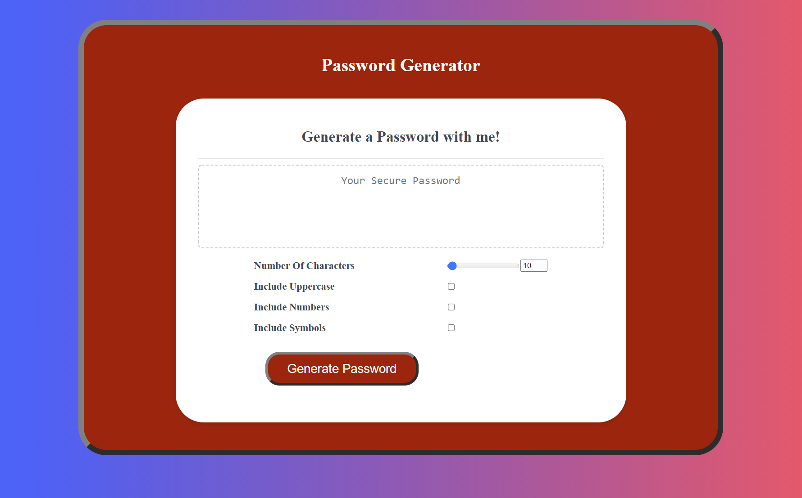

# Week-3-Homework---Password-Generator

## Introduction:
Hi there, this is my mini-project that can generate a password from 8 to 128 characters.
 

* The requirements of the task was to make the website look like this:
 

* This is what my generator looks like with some touch up:

## Link to github repo:
https://github.com/rushilchawla/Password-Generator

## Link to active page: 
https://rushilchawla.github.io/Password-Generator/